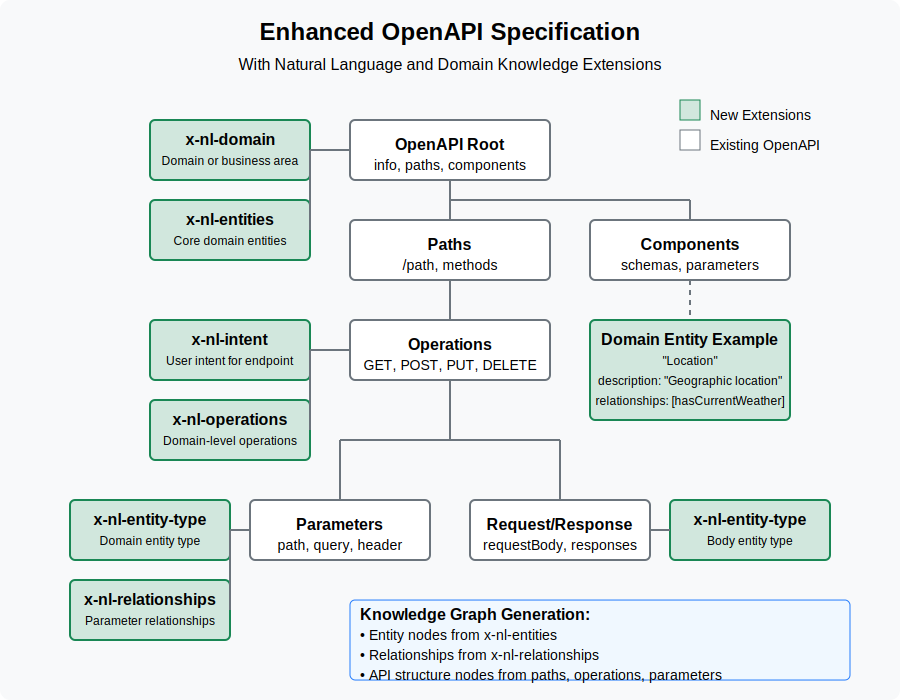

# Enhanced OpenAPI Specification (EOAS)


> Extending OpenAPI Specification with natural language semantics and domain knowledge graph capabilities

## Overview

The Enhanced OpenAPI Specification (EOAS) extends the standard OpenAPI Specification (OAS) to include semantic information crucial for natural language API interaction and automated domain knowledge graph generation. While traditional OpenAPI specifications focus on technical aspects of API endpoints, the EOAS introduces extensions that capture domain knowledge, entity relationships, and natural language intents.



## Why EOAS?

Traditional API specifications lack semantic context, making it difficult for AI systems to understand the domain-level meaning of API operations. The EOAS bridges this gap by:

1. **Enabling Natural Language Interaction** - Define user intents and map them to API operations
2. **Building Domain Knowledge Graphs** - Define entities and relationships within your API domain
3. **Improving API Discovery** - Make APIs more discoverable through semantic understanding
4. **Facilitating AI Integration** - Provide the semantic layer needed for AI systems to work with your APIs

## Key Features

- **Domain Entity Definitions** - Define the core concepts in your API domain
- **Relationship Semantics** - Specify how domain entities relate to each other
- **Natural Language Intents** - Map user intents to specific API operations
- **Parameter Entity Mapping** - Link API parameters to domain entities
- **Knowledge Graph Generation** - Automated construction of domain knowledge graphs

## Extensions

All extensions are prefixed with `x-nl-` and are optional unless specified otherwise:

| Extension | Level | Description |
|-----------|-------|-------------|
| `x-nl-domain` | Root | Specifies the business domain of the API |
| `x-nl-entities` | Root | Defines core domain entities and relationships |
| `x-nl-intent` | Operation | Natural language intent for an endpoint |
| `x-nl-operations` | Operation | Domain-level operations for an endpoint |
| `x-nl-entity-type` | Parameter/Response | Links to domain entities |
| `x-nl-relationships` | Parameter | Parameter-specific entity relationships |

## Getting Started

### Basic Usage

Add the extensions to your existing OpenAPI specification:

```yaml
openapi: 3.0.0
info:
  title: Weather API
  version: 1.0.0
x-nl-domain: "Weather Information"
x-nl-entities:
  - name: "Location"
    description: "Represents a geographical location."
    relationships:
      - name: "currentWeather"
        type: "hasCurrentWeather"
        targetEntity: "WeatherCondition"
paths:
  /weather/current:
    get:
      summary: Get current weather
      x-nl-intent: "get current weather"
      parameters:
        - name: city
          in: query
          x-nl-entity-type: "Location"
```

## Example

Here's a complete example of a Weather API with enhanced OpenAPI extensions:

```yaml
openapi: 3.0.0
info:
  title: Weather API
  version: 1.0.0
  description: API providing weather data.
x-nl-domain: "Weather Information"
x-nl-entities:
  - name: "Location"
    description: "Represents a geographical location."
    relationships:
      - name: "currentWeather"
        type: "hasCurrentWeather"
        targetEntity: "WeatherCondition"
      - name: "forecastWeather"
        type: "hasForecastWeather"
        targetEntity: "Forecast"
  - name: "WeatherCondition"
    description: "Represents current weather conditions."
  - name: "Forecast"
    description: "Represents weather forecast information."
  - name: "UnitOfMeasure"
    description: "Represents units of measurement."

paths:
  /weather/current:
    get:
      summary: Get current weather
      description: "Retrieve the current weather conditions for a given city."
      operationId: getCurrentWeather
      x-nl-intent: "get current weather"
      x-nl-operations: ["Read", "CurrentWeather"]
      parameters:
        - in: query
          name: city
          schema:
            type: string
          required: true
          description: "The city for which to retrieve weather information."
          x-nl-entity-type: "Location"
        - in: query
          name: units
          schema:
            type: string
            enum: [metric, imperial]
          description: "Units for temperature. Use 'metric' for Celsius and 'imperial' for Fahrenheit."
          x-nl-entity-type: "UnitOfMeasure"
          x-nl-relationships:
            - name: "unitContext"
              type: "unitOf"
              targetEntity: "WeatherCondition"
      responses:
        '200':
          description: Successful response
          content:
            application/json:
              schema:
                $ref: '#/components/schemas/Weather'
              x-nl-entity-type: "WeatherCondition"
```

## Tools and Implementation [TBD]

The following tools are planned:

- **EOAS Validator** - Validate enhanced OpenAPI specifications
- **Knowledge Graph Generator** - Generate domain knowledge graphs from specifications
- **Intent Catalog Builder** - Extract and organize API intents from specifications
- **Visualization Tools** - Visualize domain knowledge graphs

## Community and Contributions

Contributions are welcome! Please feel free to submit a Pull Request.


## License

This project is licensed under the Apache License 2.0 - see the [LICENSE](LICENSE) file for details.

## Acknowledgments

- OpenAPI Initiative for the core OpenAPI Specification
- Contributors to the semantic web and knowledge graph communities
- All early adopters and feedback providers